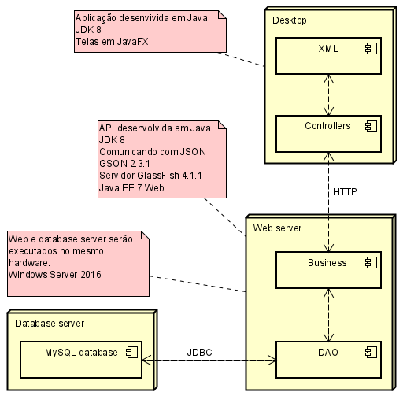

# Recicla
## O que é?
Um projeto voltado para o tema de sustentabilidade onde tem o objeto de utilizar a ludificação (conhecida também como gamificação) para conscientizar principalmente as crianças sobre a inportância de deste assunto.
## Utilizado para desenvolvimento
* Java
* NetBeans 8.3 RC
* JDK 8
* Telas em JavaFX com auxilio do Scene Builder
* GlassFish Server 4.1.1
* Java EE 7
* MySQL ?.? no XAMPP
## Modelo de dados

## Arquiteura para implantação

